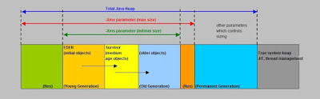

#### 64 位 JVM 中，int 的长度是多数？
Java 中，int 类型变量的长度是一个固定值，与平台无关，都是 32 位。意思就是说，在 32 位 和 64 位 的Java 虚拟机中，int 类型的长度是相同的。

#### Serial 与 Parallel GC之间的不同之处？
Serial 与 Parallel 在GC执行的时候都会引起 stop-the-world。它们之间主要不同 serial 收集器是默认的复制收集器，执行 GC 的时候只有一个线程，而 parallel 收集器使用多个 GC 线程来执行。

#### 32 位和 64 位的 JVM，int 类型变量的长度是多数？
32 位和 64 位的 JVM 中，int 类型变量的长度是相同的，都是 32 位或者 4 个字节。

#### Java 中 WeakReference 与 SoftReference的区别？
虽然 WeakReference 与 SoftReference 都有利于提高 GC 和 内存的效率，但是 WeakReference ，一旦失去最后一个强引用，就会被 GC 回收，而SoftReference虽然不能阻止被回收，但是可以延迟到 JVM 内存不足的时候。

#### WeakHashMap 是怎么工作的？
WeakHashMap 的工作与正常的 HashMap 类似，但是使用弱引用作为 key，意思就是当 key 对象没有任何引用时，key/value 将会被回收。

#### JVM 选项 -XX:+UseCompressedOops 有什么作用？为什么要使用？
当你将你的应用从 32 位的 JVM 迁移到 64 位的 JVM 时，由于对象的指针从 32 位增加到了 64 位，因此堆内存会突然增加，差不多要翻倍。这也会对 CPU 缓存（容量比内存小很多）的数据产生不利的影响。因为，迁移到 64 位的 JVM 主要动机在于可以指定最大堆大小，通过压缩 OOP 可以节省一定的内存。通过 -XX:+UseCompressedOops 选项，JVM 会使用 32 位的 OOP，而不是 64 位的 OOP。

#### 怎样通过 Java 程序来判断 JVM 是 32 位 还是 64 位？
你可以检查某些系统属性如 sun.arch.data.model 或 os.arch 来获取该信息。

#### 32 位 JVM 和 64 位 JVM 的最大堆内存分别是多数？
理论上说上 32 位的 JVM 堆内存可以到达 2^32，即 4GB，但实际上会比这个小很多。不同操作系统之间不同，如 Windows 系统大约 1.5 GB，Solaris 大约 3GB。64 位 JVM允许指定最大的堆内存，理论上可以达到 2^64，这是一个非常大的数字，实际上你可以指定堆内存大小到 100GB。甚至有的 JVM，如 Azul，堆内存到 1000G 都是可能的。

#### JRE、JDK、JVM 及 JIT 之间有什么不同？
JRE 代表 Java 运行时（Java run-time），是运行 Java 引用所必须的。JDK 代表 Java 开发工具（Java development kit），是 Java 程序的开发工具，如 Java 编译器，它也包含 JRE。JVM 代表 Java 虚拟机（Java virtual machine），它的责任是运行 Java 应用。JIT 代表即时编译（Just In Time compilation），当代码执行的次数超过一定的阈值时，会将 Java 字节码转换为本地代码，如，主要的热点代码会被准换为本地代码，这样有利大幅度提高 Java 应用的性能。

#### 解释 Java 堆空间及 GC？(答案)
当通过 Java 命令启动 Java 进程的时候，会为它分配内存。内存的一部分用于创建堆空间，当程序中创建对象的时候，就从对空间中分配内存。GC 是 JVM 内部的一个进程，回收无效对象的内存用于将来的分配。

#### 你能保证 GC 执行吗？
不能，虽然你可以调用 System.gc() 或者 Runtime.gc()，但是没有办法保证 GC 的执行。

#### 怎么获取 Java 程序使用的内存？堆使用的百分比？
可以通过 java.lang.Runtime 类中与内存相关方法来获取剩余的内存，总内存及最大堆内存。通过这些方法你也可以获取到堆使用的百分比及堆内存的剩余空间。Runtime.freeMemory() 方法返回剩余空间的字节数，Runtime.totalMemory() 方法总内存的字节数，Runtime.maxMemory() 返回最大内存的字节数。

#### Java 中堆和栈有什么区别？
JVM 中堆和栈属于不同的内存区域，使用目的也不同。栈常用于保存方法帧和局部变量，而对象总是在堆上分配。栈通常都比堆小，也不会在多个线程之间共享，而堆被整个 JVM 的所有线程共享。

